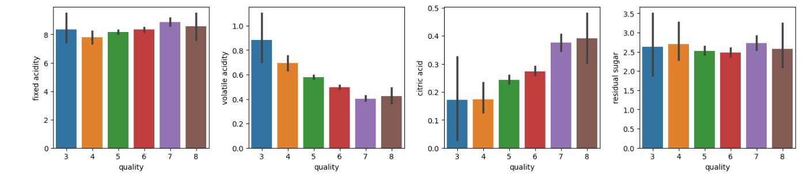
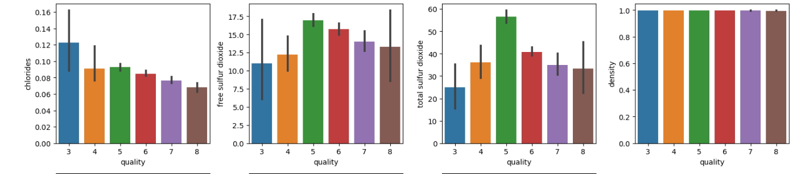
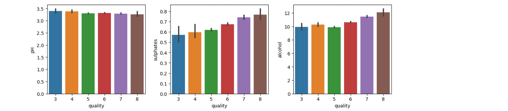
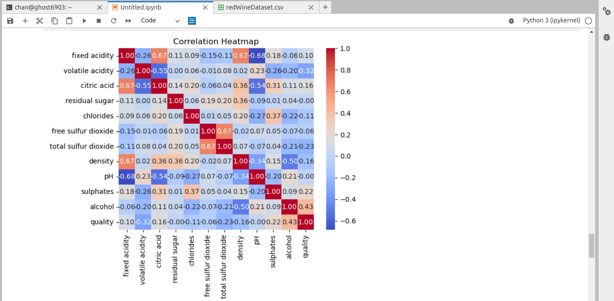
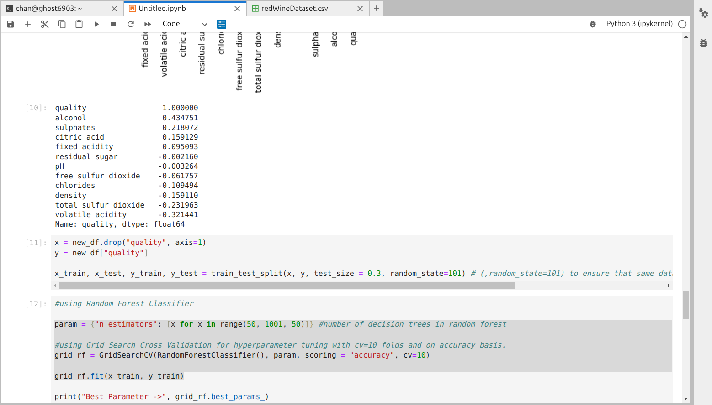
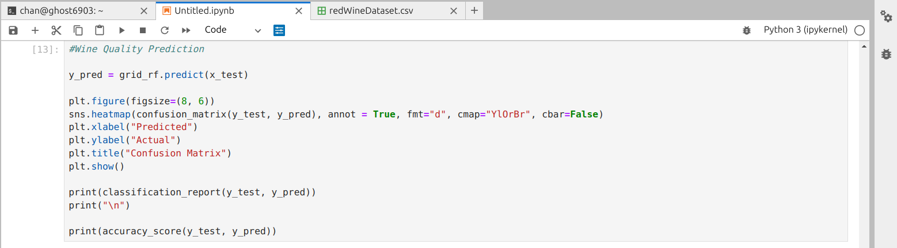
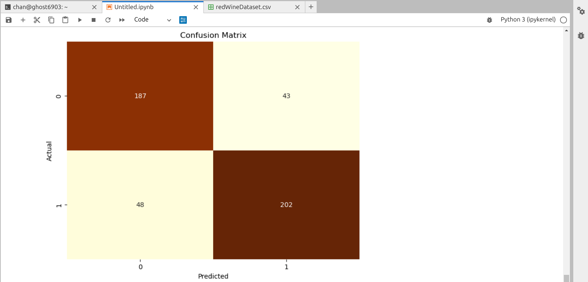
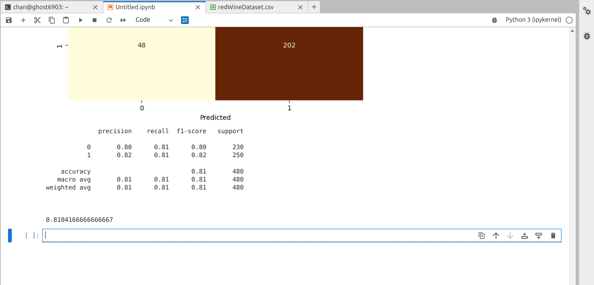

# wineQualityPred
An ML model to predict the wine quality based on Random Forest Classifier model.

# Wine Quality Prediction

## Overview

This project focuses on predicting the quality of wines based on various attributes. The dataset used for this project contains information about different wines and their associated quality ratings.

## Table of Contents

- [Dependencies](#dependencies)
- [Project Description](#project-description)
- [Data Exploration](#data-exploration)
- [Machine Learning Model](#machine-learning-model)
- [Hyperparameter Tuning](#hyperparameter-tuning)
- [Evaluation Metrics](#evaluation-metrics)
- [Usage](#usage)
- [Contributing](#contributing)
- [License](#license)

## Dependencies

This project was developed using the following Python libraries and tools:

- [Pandas](https://pandas.pydata.org/)
- [NumPy](https://numpy.org/)
- [Matplotlib](https://matplotlib.org/)
- [Seaborn](https://seaborn.pydata.org/)
- [Scikit-Learn](https://scikit-learn.org/stable/)

## Project Description

In this project, I have aimed to predict the quality of wines using machine learning techniques. The key steps in the project include:

### Data Collection

Attached a dataset containing information about wines, including various features and their quality ratings.

### Data Exploration

Used Pandas and NumPy for exploratory data analysis (EDA) to gain insights into the dataset. This involved summary statistics, data visualization using Matplotlib and Seaborn, and identifying patterns and correlations.

### Machine Learning Model

Implemented a machine learning model for wine quality prediction. Chose to use the Random Forest Classifier, a popular ensemble learning algorithm, for this task.

### Hyperparameter Tuning

To optimize the Random Forest Classifier's performance, used Grid Search Cross-Validation with 10 folds to fine-tune hyperparameters, specifically the number of decision trees in the forest.

```python
param = {"n_estimators": [x for x in range(50, 1001, 50)]} # Number of decision trees in Random Forest
grid_rf = GridSearchCV(RandomForestClassifier(), param, scoring="accuracy", cv=10)
grid_rf.fit(x_train, y_train)
```

### Evaluation Metrics

Evaluated the model using various metrics, such as accuracy, classification report, and confusion matrix, to assess its performance on predicting wine quality.









